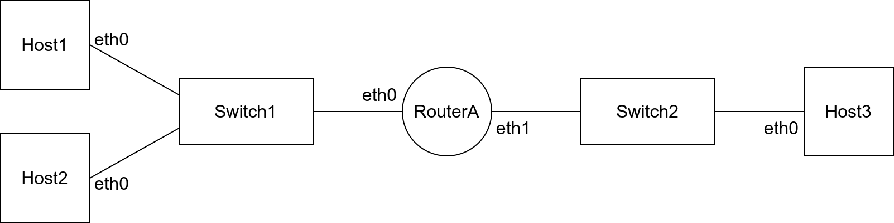

# Linux Networking - Getting Started

# A Simple Network Model

We first define a simplified view of a computer network.

## Devices and Links

A network consists of *devices* connected via *links*. Devices are generally layer 2 (data link layer) devices such as switches, hubs and access points, or layer 3 (network layer) and above, such as end-user computers, routers and server computers. Devices are also called nodes. 

We generally will not deal much with layer 2 devices. They will be used, but not configured in Linux.

We divide layer 3 devices into two categories based on their ability to forward IP packets:

- *Hosts*: will not forward IP packets. End-user computers (PCs, laptops) are typically hosts, and computers running servers may also be a host (e.g., computer running web server). Hosts are also referred to as end devices.
- *Routers*: can forward IP packets to other devices. Routers are also referred to as intermediate devices (along with most layer 2 devices).

A network also often has devices which have a dedicated role, e.g., firewalls, web servers, DNS servers. The role is independent of the devices type. That is, a host may be a firewall, as may a router. And while web servers often run on hosts, they may also run on a router. And devices may have multiple roles, e.g., a router may be a firewall and DNS server.

From now on we will refer to devices as either: layer 2 devices, host and routers. 

Devices are connected via links. We are not going to distinguish between the type of links (wireless, Ethernet, optical fibre) at this stage. They are all just links.

Devices have *interfaces* which can be used to connect to a link. Interfaces are also called or directly associated with ports, (network) adapters, and (network interface) cards. We will often see *if* or *dev* used to refer to an interface (device). An example is a computer that has two ports to plug two LAN cables into: that computer has two interfaces (and maybe even more, e.g., for WiFi).

## Hardware and IP Addresses

Layer 2 communication occurs between devices using *hardware addresses*. A hardware address is often also called a MAC address, physical address, layer 2 address, or data link layer address. Hardware addresses are assigned per interface. We will assume one interface can have one hardware address. Often hardware addresses are assigned to the interface hardware by the manufacturer, and never change.

Layer 3 communication occurs between devices using *IP addresses* (also called network address, internet address, layer 3 address). IP addresses are assigned per interface, usually by the network administrator (you). 

There are two versions of IP: IPv4 and IPv6. We are focussing only on IPv4 as it is still very common (and a little bit easier to start with for a beginner). 

This simplified model of a computer network is sufficient to get started with configuring networks in Linux. But in reality, computer networks are more complex than what is described here, and there are many exceptions as well as  cases where this model is not correct. However it is sufficient for now. 

We assume you know the above computer networking concepts, e.g., the role of switches and routers, structure of IP addresses, how IP forwarding and routing works. 

# Hosts, Routers and Interfaces in Linux

In Linux, all computers can generally be either a host or router. It is a small configuration change to switch between host and router, specifically, enabling/disabling IP forwarding. 

We will assume each host and router has 1 or more physical network adapters, and each adapter is assigned an interface name in Linux. Interfaces are often named based on the type of network technology and the number of the adapter in the computer. As Ethernet is widely used, you will commonly see interfaces called: ``eth0``, ``eth1``, ``eth2`` and so on. However another naming scheme is ``enp0s0``, ``enp0s1``, ``enp1s0``, and so on. For wireless adapters, interfaces may be ``wl0``, ``wlo1``, ``wifi2`` and similar. Other interface names you may come across include: ``lo``, ``vboxnet0``, ``tun2``, ``br`` (loopback, VirtualBox network, tunnel, bridge). Interfaces are assigned to network adapter devices, so ``dev`` is used to refer to an interface in many commands.



# ip: Viewing and setting networking configuration

The ``ip`` command is used for viewing and setting networking configurations, usually applied to interfaces on a host or router. The command has multiple objects to operate on, and supports various options. To see them, simply run ``ip`` or view the man(ual) page (in Linux with ``man ip`` or searching online). Here we show selected ``ip`` commands to get started. We show the command via examples. You will need to change values, e.g., the actual IP address or interface name must be specified.

## Addressing

View your IP addresses (and other information) for each interface:

```
ip address show
```

Set the IP address for a specific interface (example with IP 1.1.1.1 with network mask /24 and applied to interface device ``eth0``):

```
ip address add 1.1.1.1/24 dev eth0
```

## Links

The interface connects to a link. You can use the link object to turn an interface on or off, which is referred to as up or down.

Turn an interface off (down):

```
ip link set eth0 down
```

Turn an interface on (up):

```
ip link set eth0 up
```

## ARP and Neighbours

ARP is used automatically by Linux computers to find the hardware address of neighbours on the same subnet. While we do not normally need to get involved in the ARP process, it is useful to view current ARP table:

```
ip neigh show
```

You will often be interested in the: IP address, interface, hardware address and state (such as REACHABLE, STALE or INCOMPLETE).

## Routes

View the routing table of your Linux computer:

```
ip route show
```

Add a default route via router 1.1.1.1 using interface eth0:

```
ip route add default via 1.1.1.1 dev eth0
```

Add a route to a specific subnet (3.3.3.0/24) via router 1.1.1.1 using interface eth0:

```
ip route add 3.3.3.0/24 via 1.1.1.1 dev eth0
``` 

# sysctl: Enabling forwarding

In Linux, a host will not forward IP packets but a router will. There is an operating system parameter that determines if the Linux device will forward packets or not. The parameter is changed with the ``sysctl`` command:

To see the current status:

```
sysctl net.ipv4.ip_forward
```

To enable forwarding (making the device a router):
```
sysctl net.ipv4.ip_forward=1
```

To disable forwarding (making the device a host):
```
sysctl net.ipv4.ip_forward=0
```

In large networks, there can be significant hardware differences between routers and hosts, but conceptually in our simplified model of a network, it is whether the device forwards or not.


# ping: Testing network communications

ping is a widely used tool to test layer 3 network communications, i.e., to check that a destination host or router is reachable using ICMP. It also reports the round-trip-time (as well as other information). Simply specific the destination IP address, e.g.:

```
ping 1.1.1.1
```
To stop the ping, use Ctrl-C. To limit the number of pings so it automatically stops, use the ``-c`` option:

```
ping -c 3 2.2.2.2
```

# nc: Testing application communications

ping uses ICMP to communicate with another host or router. Sometimes you want to test application level communications, using TCP as a transport protocol. netcat, abbreviated to ``nc``, can be used as a client and server to test a simple TCP connection. netcat (nc) requires running in server mode on one device, and then in client mode on another device.

Start nc in server mode on device with IP 2.2.2.2 using port 12345:

```
nc -l -p 12345
```

It should show a blank line if it starts successfully. It will not return to the prompt; it just sits there waiting until a client connects.

Now on device with IP 1.1.1.1, start nc in client mode:

```
nc 2.2.2.2 12345
```

Again, it waits for input. Now you can type in a message, e.g. ``hello`` at the client, and that message should be shown at the server. You can also type in a message at the server to send to the client.

To end nc, press Ctrl-C.

Be careful: different variants of Linux (or BSD) use different implementations of netcat, and the options are not always identical. Often if you just run the command with no options, e.g. ``nc``, a short help will be shown.

# iperf: Testing throughput performance

iperf is a tool that will run throughput (bandwidth) performance tests. It needs to be run in server mode on one computer, and then client mode on another computer to initiate a test. 

Start iperf in server mode on device with IP 2.2.2.2:
```
iperf -s
```
It should show some iperf output and then wait for a client to connect.

Now on device with IP 1.1.1.1, start iperf in client mode:
```
iperf -c 2.2.2.2
```
That initiates a TCP throughput test to the server for about 10 seconds. Then the results (average throughput) will be shown, and the client will stop. You can run another test to the same server if needed. To stop the server, press Ctrl-C on the server.

Note that some systems use iperf version 2 (command is ``iperf``) and others use iperf version 3 (command is ``iperf3``). They do NOT work together, e.g., you cannot run iperf3 as server and iperf as client - they need to be the same version at both ends.

# nano: Text Editor

Many Linux systems come with the nano text editor. If nano is not installed, you will need to use the vi text editor. To start the text editor, specify the filename to edit, e.g., to edit the ``interfaces`` file within the directory ``/etc/network``:

```
nano /etc/network/interfaces
```

You can directly edit with your keyboard. The menu is at the bottom, with ^ meaning Ctrl. To save, Ctrl-O. To exit, Ctrl-X. 

# vi: Text Editor

If nano is not installed, then it is highly likely vi text editor is. vi is not as straight forward as nano. Open a file:

```
vi /etc/network/interfaces
```

To make edits, you must enter insert mode by pressing ``i``. Now you can edit. To save/exit you must first exit insert mode by pressing ESQ. Then type ``:wq`` to write (save) and quit.

# /etc/network/interfaces: Persistent IP Addresses

We can use the ``ip address`` command to set an IP address for an interface in Linux. But upon reboot, that setting is lost. To maintain the IP configuration across reboots, you can edit the file ``/etc/network/interfaces`` with nano or vi.

```
nano /etc/network/interfaces
```

Lines starting with # are commented out. Remove the # for the line(s) to have effect.

There are two common approaches: static IP or dynamic IP from DHCP server. For a static IP, the syntax is:

```
auto eth0
iface eth0 inet static
   address 1.1.1.22
   netmask 255.255.255.0
   gateway 1.1.1.1
```

Change the interface, IP, netmask and default router (gateway) as required.

To automatically obtain an IP from a DHCP server use:

```
auto eth1
iface eth1 inet dhcp
```

After editing the file, either reboot or turn the interface down then up.

# OpenWRT: Basic Networking

OpenWRT runs Linux but the configuration files are different from most other Linux systems. It uses the Unified Configuration Interface (UCI) for most network configuration (persistent IP addresses, firewall, DHCP, ...). You can find details at https://openwrt.org/docs/guide-user/base-system/uci. Here we show some simple examples of the configuration files. Note that the files need to be edited with a text editor, normally vi (unless nano is installed).

Most configuration files are in the directory:

```
/etc/config
```

Normally the service needs to be restarted for any changes to take effect. To restart, use the service managers in the directory:

```
/etc/init.d
```

## /etc/config/network: Persistent IP Addresses in OpenWRT

The file ``/etc/config/network`` can be edited to set persistent IP addresses for interfaces. This is a similar approach to ``/etc/network/interfaces`` in other Linux systems, but uses a different file and syntax. Here is a sample with a static IP for a LAN interface (br-lan, which is bridged with eth0) and a DHCP address for a WAN interface (eth1).

```
config interface 'lan'
   option device 'br-lan'
   option proto 'static'
   option ipaddr '192.168.1.1'
   option netmask '255.255.255.0'
   # option gateway '1.1.1.1'

config interface 'wan'
   option device 'eth1'
   option proto 'dhcp'
```
Note the gateway is not used in the example, but included (commented out) just to show the syntax if you need to add a gateway.

Once you change the configuration, either reboot the OpenWRT router or restart networking with:

```
/etc/init.d/network restart
```

Further details are [https://openwrt.org/docs/guide-user/network/ucicheatsheet](https://openwrt.org/docs/guide-user/network/ucicheatsheet).

## DHCP, DNS, Firewall, SSH Server in OpenWRT

Other services are configured in a similar manner but have different files. Some you may use include:

- [DHCP server](https://openwrt.org/docs/guide-user/base-system/dhcp): ``/etc/config/dhcp``
- DNS server: ``/etc/config/dhcp`` (OpenWRT configures DHCP and DNS together)
- [Firewall](https://openwrt.org/docs/guide-user/firewall/firewall_configuration): ``/etc/config/firewall``
- [SSH Server](https://openwrt.org/docs/guide-user/base-system/dropbear): ``/etc/config/dropbear``
- [Web Server](https://openwrt.org/docs/guide-user/services/webserver/uhttpd): ``/etc/config/uhttpd`` (primarily used for a web interface for managing the router)

These have equivalent service managers (to start, stop, restart) in the ``/etc/init.d`` directory, e.g.:

```
/etc/init.d/firewall restart
```

Note the DHCP server is odhcpd and the DNS server is dnsmasq.
