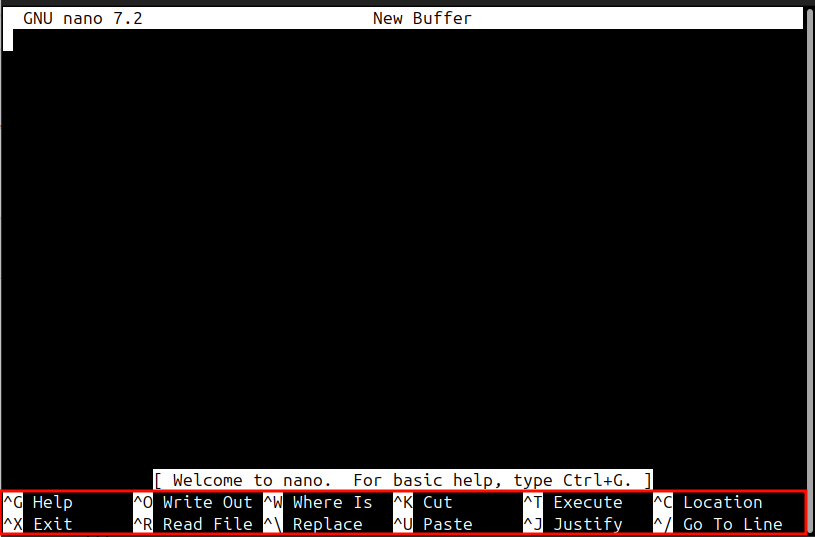

# Text Editor Basics in Linux: nano and vi

## nano: A Beginner-Friendly Text Editor

The text editor ``nano`` is usually an easy text editor to get started with for beginners.

Start nano by simply type the command followed by the name of the file you want to edit (it can be an existing file or a file that has not been created yet):
```
nano example.txt
```
You can immediately start typing your text content. You will see the menu at the bottom of the screen. The hat ^ character means the Ctrl key, e.g., ^X means Ctrl and x.


### nano: Save and Exit with Ctrl-o and Ctrl-x

In nano (and many aspects of Linux), to save a file involved *writing* the file out to disk. In nano to save a file press Ctrl and o. 


### nano: Cut and Paste Lines with Ctrl-k and Ctrl-u

## vi: A Widely Available Text Editor

Some Linux systems may not have ``nano`` installed. You usually have two options: install nano or or use the ``vi`` text editor.

### vi: Switch between modes with i and Esc

vi has a Command mode where key presses are consider operations on a text file (like save and exit) and an Insert mode where you actually type the content of your file. When you start vi you are initially in the Command mode.

To switch to Insert mode so you can enter text, press *i*. You can now start typing your content.

To switch back to Command mode, press *Esc* (the Escape key)

### vi: Save and Exit with :w and :q

When you are in Command mode, to save (write) a file press *:w* and to exit (quit) from vi press *:q*. You can even combined them into *:wq*.


