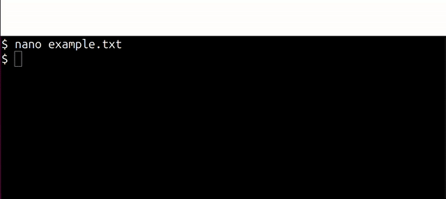
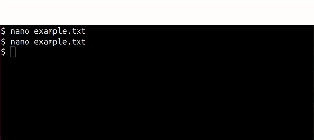

# Text Editor Basics in Linux: nano and vi

Many aspects of the Linux operating system and applications are managed via plain text files. That is, configuration options are stored in text files, and when software starts it reads the configuration from those files. Therefore in Linux you may spend a lot of time viewing/editing text files to manage the configuration of the operating system and applications. As there is often no GUI (no mouse) in a Linux system, and only a command line interface, you will need to become familiar with basic text editing capabilities.

For beginners, you are recommended to use a text editor called *nano*. Note that some systems may not have nano installed, so it is also useful to be familiar with another text editor called *vi*.

Here we give examples of the very basics of saving a file and existing the editor, which is enough to get you started. You can epxlore other features of Linux text editors yourself. 

## nano: A Beginner-Friendly Text Editor

The text editor ``nano`` is usually an easy text editor to get started with for beginners.

Start nano by simply type the command followed by the name of the file you want to edit (it can be an existing file or a file that has not been created yet):
```
nano example.txt
```
You can immediately start typing your text content. You will see the menu at the bottom of the screen. The hat ^ character means the Ctrl key, e.g., ^X means Ctrl and x.


### nano: Save and Exit with Ctrl-o and Ctrl-x

In nano (and many aspects of Linux), to save a file involved *writing* the buffer out to disk. In nano to save a file press Ctrl and o. Once saved you can exit with Ctrl-x:


When you save you are given the option to change the file name. Normally you can just press *Enter* to keep the same file name.

If you attempt to exit without a file being saved you will be prompted if you want to save the file (buffer) first. usualyl you press *y* and then *Enter* to keep the same file name




### nano: Cut and Paste Lines with Ctrl-k and Ctrl-u

You can cut entire lines with Ctrl-k and then paste back with Ctrl-u.




## vi: A Widely Available Text Editor

Some Linux systems may not have ``nano`` installed. You usually have two options: install nano or or use the ``vi`` text editor.

Similar to nano, start vi with:
```
vi exampletxt
```

### vi: Switch between modes with i and Esc

vi has a Command mode where key presses are consider operations on a text file (like save and exit) and an Insert mode where you actually type the content of your file. When you start vi you are initially in the Command mode.

To switch to Insert mode so you can enter text, press *i*. You can now start typing your content.

To switch back to Command mode, press *Esc* (the Escape key)

### vi: Save and Exit with :w and :q

When you are in Command mode, to save (write) a file press *:w* and to exit (quit) from vi press *:q*. You can even combined them into *:wq*.


